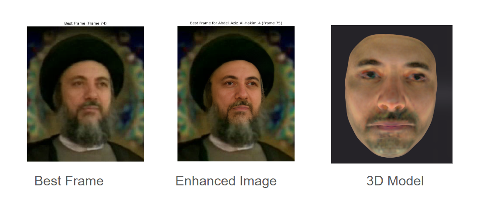
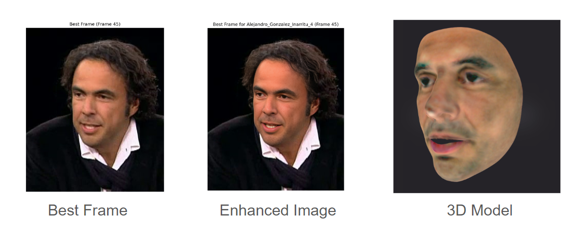

# Facial Recognition, Enhancement, and Reconstruction from CCTV Footage

## Overview
This project addresses a critical challenge in security and forensic investigations: reconstructing human faces from low-quality CCTV footage. Developed by **Apoorv Goyal**, **Pranay Arora**, **Mudit Gandhi**, and **Yaagik Goel**, this advanced Machine Learning solution leverages state-of-the-art techniques in image super-resolution, computer vision, and 3D facial reconstruction to enhance and rebuild faces from blurry or distorted images captured by CCTV cameras.

## Key Features
- **RealESRGAN & GFPGAN**: Utilizes advanced super-resolution techniques to improve the quality of low-resolution images.
- **Computer Vision**: Applies powerful face detection and enhancement methods to refine facial features.
- **Face Landmarks & Mesh Analysis**: Provides precise identification and reconstruction of facial features through mesh analysis.
- **Bounding Box Handling**: Implements robust detection of facial regions, even in difficult-to-analyze frames.
- **NextFace & 3D Face Reconstruction**: Uses 3D modeling techniques to create detailed facial reconstructions from low-quality images.

## Project Goal
The main objective is to provide a powerful tool for forensic investigations by reconstructing human faces from low-quality footage, thus enabling faster and more accurate identification of suspects and individuals.

## Contributions and Learnings
This project was a significant learning experience for the team, enhancing our understanding of AI-driven forensic analysis. We developed key insights into super-resolution techniques and 3D facial reconstruction, which we hope will prove useful in real-world forensic scenarios.

## Usage
For detailed steps on setting up and running this project, refer to the installation and setup guide in the provided Jupyter notebook (`Facial_Recognition_and_Reconstruction.ipynb`).

## License
This project is licensed under the MIT License. See the LICENSE file for more details.
